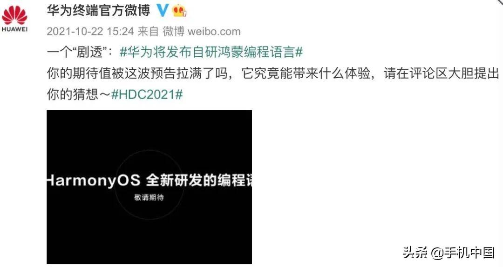
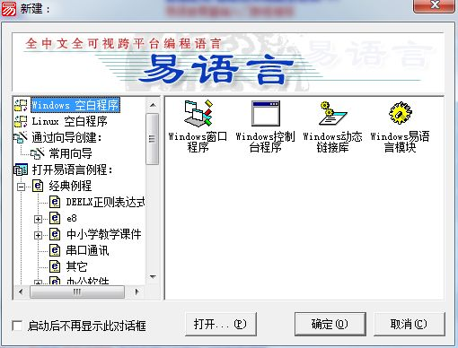
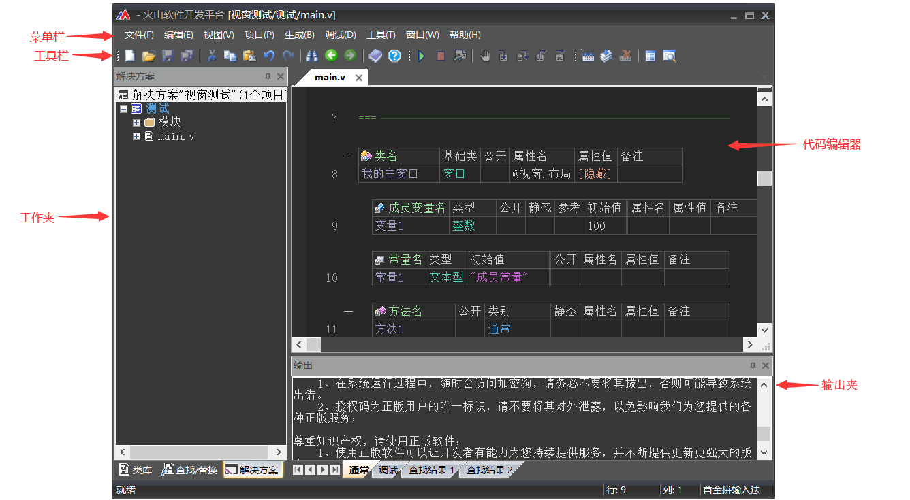

# program system base on knowledge graph and Chinese text feature

## Introduction
&ensp;&ensp;In nowadays, there are many programming language in the internet. They using the formation language or Identifier Language, just like Java or Ruby.
There is a same point of all programming language, they are using the English for programming.So if we can build a Chinese Programming System, it will cause the chinese developer learn the programming more easier and more comfortable.
## existent research statement
### Chinese research
&ensp;&ensp;In 2021, HuaWei Corporation showing a program language project which name 'CangJie'(仓颉). CangJie is a chinese program language. But up to now, there is still no public release. Therefore, it can be found that the current domestic research and progress in Chinese programming is not very successful. The CangJie language was design for program the application for the Harmony OS.  
 

Figure 1.Description of Cangjie language project

&ensp;&ensp;On the Other side , YiYuYan is a more success project ,unlike the CangJie , the YiYuYan project was released and in ommercial operation.But in the YiYuYan , YiYuYan grammar more like Visual Basic language. In YiYuYan program compiler , it has a surface program part and a code program window. So it can program the surface and logic in the same time. However, its syntax is quite simple and function-oriented direct programming, which limits its expansion of algorithms and functions and the development of third-party libraries.[1]
 

 

Figure 2. the surface of YiYuYan Compiler

&ensp;&ensp;In the other hand, HuoShan Programming Compiler is a successful IDEA. The HuoShan Programming Language was more like Java or C#. And the HuoShan Compiler has two version, one for the Android OS planform compiler, the other one for the Windows OS PC planform. But if we looking into its core, we can find that this language programming by formatting language and it more like a programming language transformer. 

 

Figure 3. the surface of HuoShan Compiler

&ensp;&ensp;In the terms of feature extraction of Chinese text has many research and analysis mathod. In 
Chinese text feature extraction , the fashion way is SVM and KNN mathod to catch the feature.[4] In recent years, many researcher using the BERT model to analysis and catch the text feature.[5]  
Through this way, the chinese text can be transform to a text feature and make a grammar to let the computer can understand the chinese language, so than can make chinese programming possible.

## System design
&ensp;&ensp;This system include three module. Each one has different function. First is the transformer, Sencond is the script runner, Thrid is the language transformer. 
&ensp;&ensp;First module is the mechanism language transformer. This module transform chinese into mechanism language or middle language( like a script ). And this module design to work by Chinese text feature extraction.
&ensp;&ensp;Sencond module is the script runner. This module execute the middle language or mechanism language which is come from the mechanism language transformer. 
&ensp;&ensp;Thrid module is the other language transformer. This module can transform the middle language or script into another programming language. This module work principle is the knowledge graph. By knowledge graph, the middle language can be understand to the mechanism and transform into C/C++ or Java.

 

Figure 4. system and module design

  

## purpose of system
1st. Chinese language program. System can allow chinese program. And System using the nature language to programming.  
2nd. Mutiple program language translate. No only base on chinese language, but also can translate program to other language. Like python, java and C/C++. 
3td. Amend the program language error. Auto amend the program language grammar error. 
4th. Simple program auto writing. Simple or short program can be writing by itself. 

## Project Creation Purpose
1. create a mathod to extract chinese text feature.
2. build a knowledge graph to transform program language.
3. upgrade the extraion mathod make the chinese text feature extraction run faster.

### Project Example 
1. Chinese Programming format example: 

&ensp;&ensp;可乐是一个对象，这个对象来自杯子这个对象，包含喝水方法和喝完方法。

the same code can writed like this: 

&ensp;&ensp;从杯子对象延伸一个对象叫可乐，可乐可以被喝和喝完。

system analyses above code into Java code like below: 
<Code>

&ensp;&ensp;class 可乐 extends 杯子 {

&ensp;&ensp;&ensp;&ensp;public void 喝(){}

&ensp;&ensp;&ensp;&ensp;public void 喝完(){}

&ensp;&ensp;}

</Code> 
2. knowledge gragh for code transform: 
for the type : string can build the gragh like below: 

 

Figure 5. the example of string knowledge gragh

  

## reference
 

[1] [刘志芳, & 董小雷. (2007). 易语言的使用与研究. 唐山师范学院学报, 29(2), 3.](https://xueshu.baidu.com/usercenter/paper/show?paperid=aa2bbc1b5177b56af556d812de57b40d&site=xueshu_se)

[2] [ 崔志磊.(2001).基于汉语编程的方法与研究.职大学报(4),2. ](https://xueshu.baidu.com/usercenter/paper/show?paperid=fbbe0ac55759adc37d1472aeaf772f6f&site=xueshu_se)

[3] [ 何志东.(2022).用汉字正负数码法实现纯中文编程和建立纯中文操作系统.  CN114115886A.](https://xueshu.baidu.com/usercenter/paper/show?paperid=1v6p04c0jp020rd0mt5w08q07s446759&site=xueshu_se)

[4] [ 代六玲, 黄河燕, & 陈肇雄. (2004). 中文文本分类中特征抽取方法的比较研究. 中文信息学报, 18(1). ](https://xueshu.baidu.com/usercenter/paper/show?paperid=be1ec9895a2c68b2e9fbcbff3a94927d&site=xueshu_se)

[5] [ 劳南新, & 王帮海. (2022). 基于bert的混合字词特征中文文本摘要模型. 计算机应用与软件(006), 039. ](https://xueshu.baidu.com/usercenter/paper/show?paperid=1n4m0ve0kp380ah09w4k0m409g184647&site=xueshu_se)
